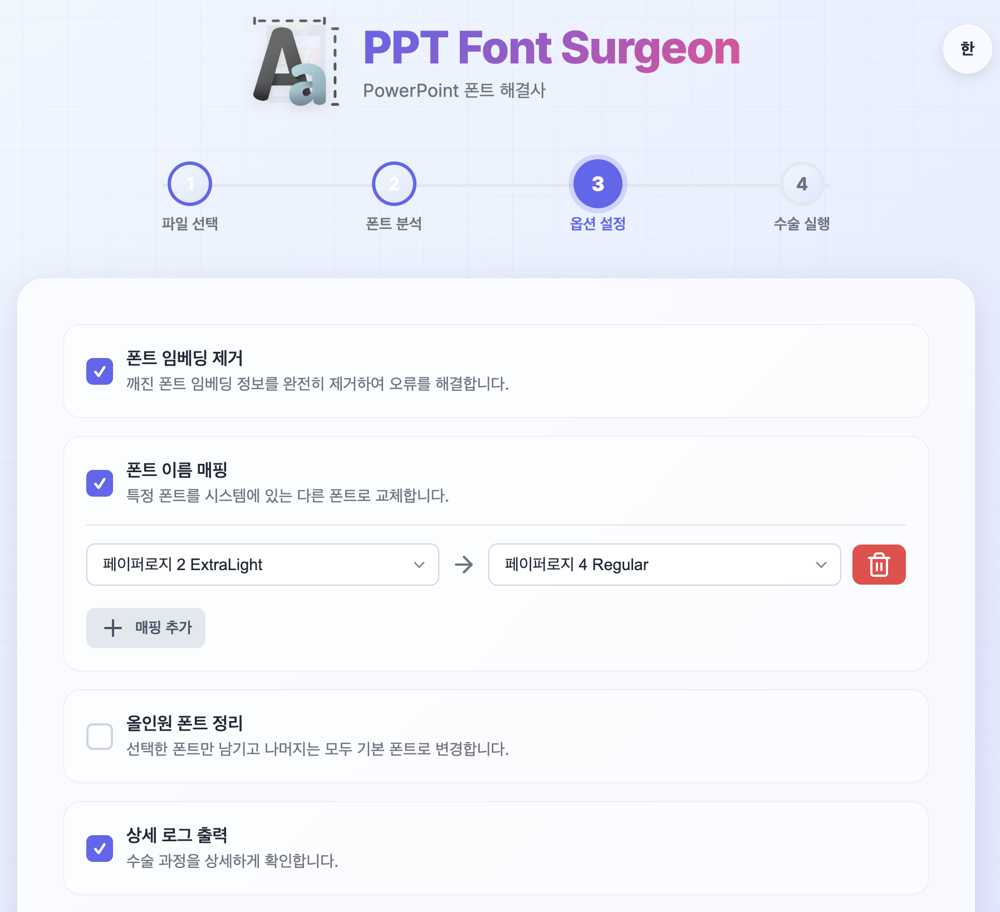

# PPT Font Surgeon 🩺



PowerPoint 프레젠테이션의 폰트 문제를 해결하는 웹 기반 도구입니다.

## ✨ 주요 기능

- **폰트 분석**: PPTX 파일에 사용된 모든 폰트를 분석
- **임베딩 제거**: 깨진 폰트 임베딩 정보를 완전히 제거
- **폰트 매핑**: 특정 폰트를 다른 폰트로 교체
- **실시간 진행**: WebSocket을 통한 실시간 처리 상태 표시
- **다국어 지원**: 한국어/영어 UI 지원
- **다크/라이트 테마**: 사용자 선호에 따른 테마 선택

## 🛠️ 기술 스택

- **Backend**: Node.js, Express.js
- **Frontend**: Vanilla JavaScript, CSS3
- **Real-time**: WebSocket (ws)
- **Core Engine**: [pptx-surgeon](https://github.com/rse/pptx-surgeon) by Dr. Ralf S. Engelschall
- **Icons**: Lucide Icons
- **Fonts**: Google Fonts (Inter, JetBrains Mono)

## 📦 설치 방법

```bash
# 저장소 클론
git clone https://github.com/YOUR_USERNAME/pptx-surgeon-web.git
cd pptx-surgeon-web

# 의존성 설치
npm install

# 서버 시작
npm start
```

서버가 `http://localhost:3000`에서 실행됩니다.

## 🚀 프로덕션 배포

### PM2를 사용한 배포

```bash
# PM2 설치
npm install -g pm2

# 앱 시작
PORT=3002 pm2 start server.js --name ppt-surgeon

# 자동 시작 설정
pm2 startup
pm2 save
```

### Nginx/Apache 리버스 프록시 설정

Apache 예시:
```apache
ProxyPass /PPTFONT/ http://127.0.0.1:3002/
ProxyPassReverse /PPTFONT/ http://127.0.0.1:3002/

# WebSocket 프록시
ProxyPass /PPTFONT/ws ws://127.0.0.1:3002/ws
ProxyPassReverse /PPTFONT/ws ws://127.0.0.1:3002/ws
```

## 📁 프로젝트 구조

```
pptx-surgeon-web/
├── public/                 # 프론트엔드 파일
│   ├── index.html         # 메인 HTML
│   ├── style.css          # 스타일시트
│   ├── script.js          # 클라이언트 JavaScript
│   ├── splash.jpg         # 스플래시 이미지
│   └── img/               # 아이콘 이미지
├── uploads/               # 업로드된 파일 (자동 생성)
├── server.js              # Express 서버
├── pptx-surgeon.js        # 메인 PPTX 처리 모듈
├── pptx-surgeon-*.js      # PPTX 처리 하위 모듈
├── package.json           # 의존성 정의
└── README.md              # 이 파일
```

## 🔒 보안 고려사항

- 업로드된 파일은 처리 후 자동 삭제됩니다
- 파일 크기 제한: 100MB
- 허용 파일 형식: .pptx만 허용
- CORS 설정 권장 (프로덕션 환경)

## 📝 사용 방법

1. **파일 선택**: PPTX 파일을 드래그 앤 드롭하거나 선택
2. **폰트 분석**: 자동으로 파일의 폰트 정보 분석
3. **옵션 설정**: 원하는 처리 옵션 선택
   - 폰트 임베딩 제거
   - 폰트 매핑
   - 상세 로그 출력
4. **수술 실행**: 처리 시작 및 진행 상황 확인
5. **결과 다운로드**: 처리된 파일 다운로드

## 🎨 스크린샷

### 메인 화면
파일 업로드 및 폰트 분석 인터페이스

### 스플래시 모달
프로젝트 정보 및 크레딧

### 처리 결과
성공적인 폰트 수술 완료 화면

## 👨‍💻 개발자

**Jinho Jung**
- Email: jvisualschool@gmail.com

## 🙏 크레딧

- **Original pptx-surgeon**: [Dr. Ralf S. Engelschall](https://github.com/rse/pptx-surgeon)
- **Icons**: [Lucide](https://lucide.dev/)

## 📄 라이선스

이 프로젝트는 원본 pptx-surgeon의 라이선스를 따릅니다.

---

Made with ❤️ by Jinho Jung | 2024